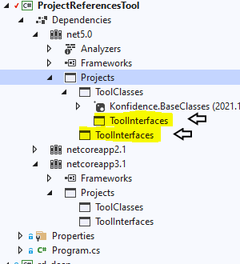
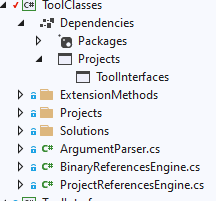
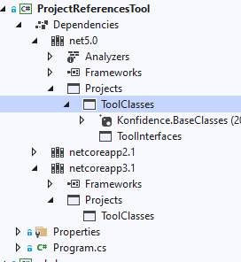
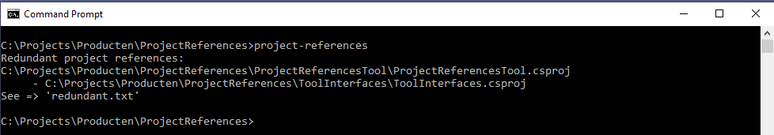
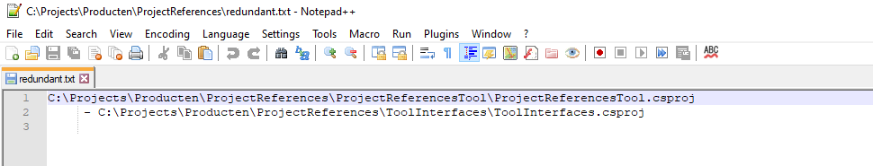

# ProjectReferences

Report redundant project references

## ProjectReferencesTool

The project references tool is a console application which scans your .cs projects for redundant references to other projects.

### Using the tool
- package: The project references tool is published as a package on [nuget.org - Konfidence.Project-References](https://www.nuget.org/packages/Konfidence.Project-References).
- install: run 'dotnet tool install --global Konfidence.Project-References'
- basic run: in a console go to your project folder and run 'project-references'.
- result 1: console displays redundant project references within the found projects in your (sub-)folders.
- result 2: creates a 'redundant.txt' file, which contains the results displayed in the console.
- actions: manually update the references in your projects and remove the redundant project references
- where: because it is a dotnetcore console application, it runs on both windows and linux.
- for whom: all dotnet c# developers creating solutions containing large amounts of projects.
 
### What does it do
- Example:
 
	If this is how the references in our project looks like (take note of the highlighted references).

	
 
	And this is the project, containing a project which should not need to be referenced in our project, because of the implicit reference. 

	  
  
	You would want to remove the reference to the ToolInterfaces project from our project, because it is already refrenced by, in this case, the ToolClasses project. 
	
	Like this:

	

	Easy to find when you have like 5 projects in your solution. But a bit harder with something like a 100 projects. 

- Running the tool would give:

	

- Also creating the file 'redundant.txt':

	

### How to run
- project-references : scans all csproj projects in your current folder and all it's subfolders.
- project-references c:\projects\myproject : scans all csproj projects in the 'c:\projects\myproject' folder and all it's subfolders. 
- project-references c:\projects\myproject\mysolution.sln : scans all csproj projects in the 'mysolution.sln' solution.
- project-references --Path=c:\projects\someotherproject : scans all csproj projects in the 'c:\projects\someotherproject' folder and all it's subfolders.  
- project-references --Path=c:\projects\someotherproject --Solution=solution.sln:  scans all csproj projects in the 'solution.sln' solution in the 'c:\projects\someotherproject' folder.

### Arguments
- folder and/or solution: scans the cproj projects in the folder & subfolders or the solution [folder]/[folder/solution.sln]
- --path= folder to scan for csproj files, including it's subfolders [--path=mypath]
- --solution= name of the solution file, the only csproj files in the solution file are scanned. [--path=mypath --solution=mysolution]/[--solution=mysolution]/[--solution=mypath\mysolution]

Arguments are case insensitive

### Issues
To be clear: issues with your solution/csproj's, not with the project-references tool.

After removing the project references, you are unable to build/rebuild your solution from visualstudio.

- There is a big chance you have to rebuild your project references tree: from a console run 'dotnet clean [my.sln]' 'dotnet restore [my.sln]'. This will reset everything and building will probably work.
- There are unused usings referencing implicitly referenced projects. This seems to corrupt the project reference tree. Always cleanup your usings when you are finished, then: from a console run 'dotnet clean [my.sln]' 'dotnet restore [my.sln]'. This will reset everything and building will probably work.
- There are old dll files which are not being removed with a clean. Remove all 'bin' && 'obj' folders, then clean and restore. 
