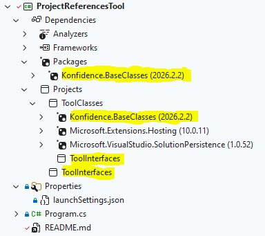
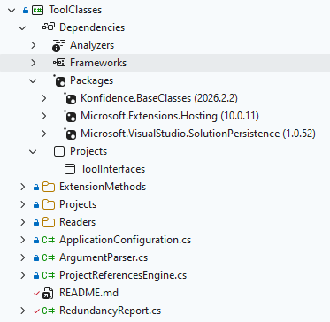
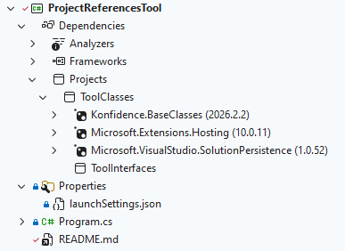
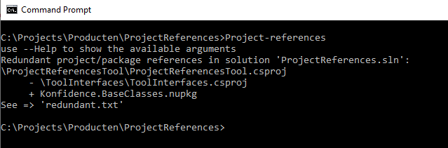
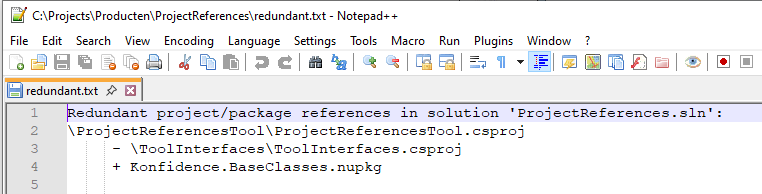

# ProjectReferences

Report redundant project references

## ProjectReferencesTool

The project references tool is a console application which scans your .cs projects for redundant references to other projects.

### Using the tool
- package: The project references tool is published as a package on [nuget.org - Konfidence.Project-References](https://www.nuget.org/packages/Konfidence.Project-References).
- install: run 'dotnet tool install --global Konfidence.Project-References'
- basic run: in a console go to your solution folder and run 'project-references'. It scans the solution named after that folder, use '--AllProjects' to scan every project below it instead.
- result 1: console displays redundant project references within the scanned projects.
- result 2: creates a 'redundant.txt' file, which contains the results displayed in the console.
- actions: manually update the references in your projects and remove the redundant project references
- where: because it is a dotnetcore console application, it runs on both windows and linux.
- for whom: all dotnet c# developers creating solutions containing large amounts of projects.
 
### What does it do
- Example:
 
	If this is how the references in our project looks like (take note of the highlighted references).

	
 
	And this is the project, containing a project which should not need to be referenced in our project, because of the implicit reference. 

	  
  
	You would want to remove the reference to the ToolInterfaces project from our project, because it is already refrenced by, in this case, the ToolClasses project. 
	
	Like this:

	

	Easy to find when you have like 5 projects in your solution. But a bit harder with something like a 100 projects. 

- Running the tool would give:

	

- Also creating the file 'redundant.txt':

	

### How to run
- project-references : scans the solution named after your current folder, so 'c:\projects\myapp' uses 'myapp.sln'.
- project-references --AllProjects : scans all csproj projects in your current folder and all it's subfolders, ignoring any solution.
- project-references --BasePath=c:\projects\myproject : uses 'c:\projects\myproject\myproject.sln'.
- project-references --Solution=mysolution : scans only the csproj projects listed in 'mysolution.sln' in your current folder.
- project-references --BasePath=c:\projects\myproject --Solution=mysolution : scans only the csproj projects listed in 'c:\projects\myproject\mysolution.sln'.
- project-references --Solution=nosuchsolution : reports 'not found : solution file' and stops.
- project-references --Solution=mysolution --AllProjects : ignores the named solution and scans every csproj project below the base path.
- project-references --Help : shows the available arguments and exits, without scanning anything.

### Arguments
- --BasePath= folder to work from, and to scan for csproj files including it's subfolders. Defaults to the folder you run the tool from. A trailing separator is ignored. [--BasePath=mypath]
- --Solution= name of the solution file, only the csproj files in the solution file are scanned. The '.sln' extension is optional. Without it the solution named after the base path folder is used, so a folder 'myapp' looks for 'myapp.sln'. When the solution cannot be found the tool reports it and stops. [--Solution=mysolution]/[--Solution=mysolution.sln]
- --AllProjects switch, ignores the solution altogether and scans every csproj file below the base path. This is the only way to scan projects which are not part of a solution. [--AllProjects]
- --Help switch, shows the available arguments and exits. A successful run prints a one line reminder that it exists, a run which reports a problem shows the arguments straight away. [--Help]

Both '--argument=value' and '--argument value' are accepted.

Arguments are case insensitive

### Issues
To be clear: issues with your solution/csproj's, not with the project-references tool.

After removing the project references, you are unable to build/rebuild your solution from visualstudio.

- There is a big chance you have to rebuild your project references tree: from a console run 'dotnet clean [my.sln]' 'dotnet restore [my.sln]'. This will reset everything and building will probably work.
- There are unused usings referencing implicitly referenced projects. This seems to corrupt the project reference tree. Always cleanup your usings when you are finished, then: from a console run 'dotnet clean [my.sln]' 'dotnet restore [my.sln]'. This will reset everything and building will probably work.
- There are old dll files which are not being removed with a clean. Remove all 'bin' && 'obj' folders, then clean and restore. 
